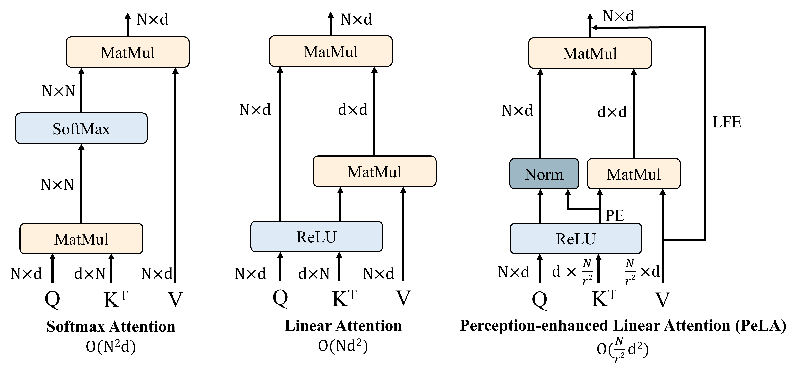
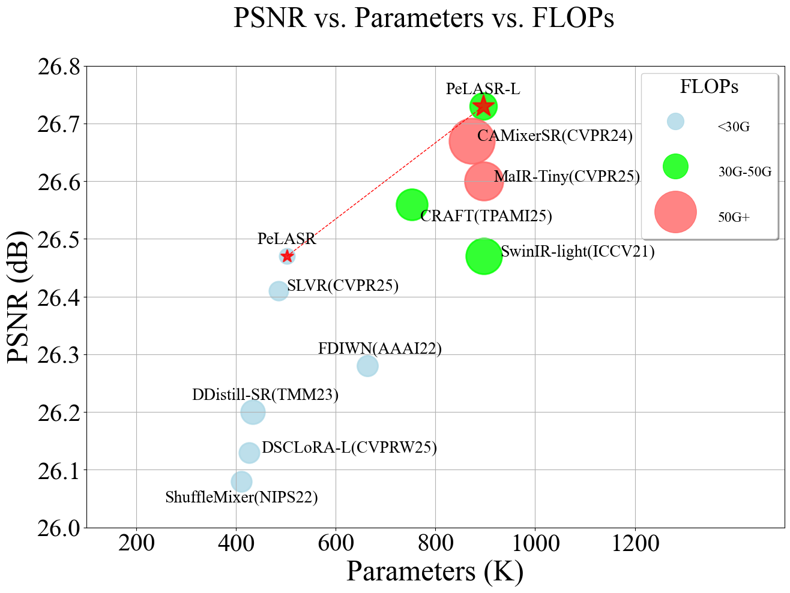
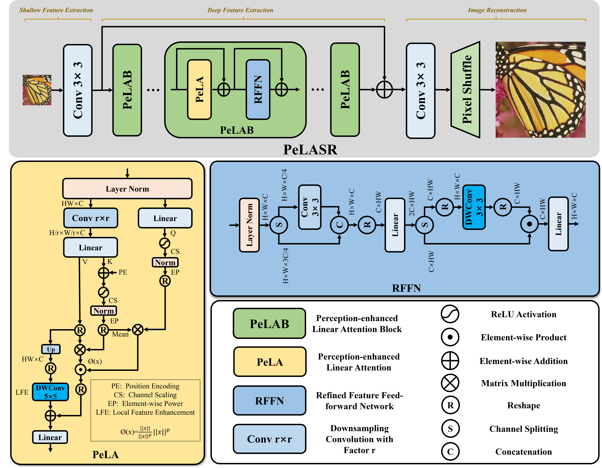

# PeLA: perception-enhanced linear attention for lightweight image super-resolution

Paper Link: https://link.springer.com/article/10.1007/s00530-026-02468-7

### Abstract

Lightweight image super-resolution (SR) requires effective deployment on edge devices under strict computational cost constraints while accurately modeling long-range dependencies. Convolutional neural networks (CNNs) offer low-latency characteristics but struggle to capture non-local features, while Transformers excel at modeling long-range dependencies but suffer from slow inference speed due to the quadratic complexity of Softmax attention. Linear attention serves as an efficient compromise; however, vanilla linear attention maps different queries to identical attention weights due to the non-injective nature of ReLU, resulting in a lack of spatial feature perception capability, making it challenging for direct application in image super-resolution, limiting performance. To alleviate this limitation, we propose Perception-enhanced Linear Attention (PeLA) specifically designed for lightweight image super-resolution. By integrating positional encoding and a feature perception mechanism, PeLA enhances the weights of critical features during attention computation. This enables linear attention to obtain distinct attention weights in a manner analogous to Softmax attention, allowing it to focus on more salient information while introducing only minimal computational overhead. Furthermore, to optimize features in conjunction with PeLA, we introduce a Refined Feature Feed-forward Network (RFFN), which refines effective features through partial channel refinement and dynamic gating, suppressing redundant features. Based on these two core components , we develop PeLASR, a lightweight SR framework. Extensive experiments demonstrate that the proposed PeLASR family outperforms existing state-of-the-art lightweight image SR methods based on CNN, Transformer, and Mamba, while maintaining low computational cost.

Motivation:



PSNR vs. Params vs. FLOPs:



### Network architecture

PELASR_arch.py is the proposed model:



### Installation
```
# Install dependent packages
cd PeLASR
pip install -r requirements.txt
# Install BasicSR
python setup.py develop
```
You can also refer to this [INSTALL.md](https://github.com/XPixelGroup/BasicSR/blob/master/docs/INSTALL.md) for installation

Put PELASR_arch.py to the path "basicsr/archs".

### Training
- Put yml to the path "options/train/".
- Run the following commands for training:
```python
python basicsr/train.py -opt options/train/train_PELASR_DF2K_d56n10_x4.yml
```
- X2, X3 are the same.

### Testing
- Download the pretrained models.
- Put yml to the path "options/test/".
- Run the following commands:
```python
python basicsr/test.py -opt options/test/test_PELASR_DF2K_d56n10_x4.yml
```
- Pretrained model is PeLASR_L_x4.pth.
- X2, X3 are the same.
- The test results will be in './results'.


### Results


## Citation
If you find this repository helpful, you may cite:

```tex
@Article{Cong2026,
author={Cong, Yizhi
and Wang, Baoting
and Guo, Hongyan
and Wang, Kai},
title={PeLA: perception-enhanced linear attention for lightweight image super-resolution},
journal={Multimedia Systems},
year={2026},
month={Jul},
day={11},
volume={32},
number={6},
pages={399},
abstract={Lightweight image super-resolution (SR) requires effective deployment on edge devices under strict computational cost constraints while accurately modeling long-range dependencies. Convolutional neural networks (CNNs) offer low-latency characteristics but struggle to capture non-local features, while Transformers excel at modeling long-range dependencies but suffer from slow inference speed due to the quadratic complexity of Softmax attention. Linear attention serves as an efficient compromise; however, vanilla linear attention maps different queries to identical attention weights due to the non-injective nature of ReLU, resulting in a lack of spatial feature perception capability, making it challenging for direct application in image super-resolution, limiting performance. To alleviate this limitation, we propose Perception-enhanced Linear Attention (PeLA) specifically designed for lightweight image super-resolution. By integrating positional encoding and a feature perception mechanism, PeLA enhances the weights of critical features during attention computation. This enables linear attention to obtain distinct attention weights in a manner analogous to Softmax attention, allowing it to focus on more salient information while introducing only minimal computational overhead. Furthermore, to optimize features in conjunction with PeLA, we introduce a Refined Feature Feed-forward Network (RFFN), which refines effective features through partial channel refinement and dynamic gating, suppressing redundant features. Based on these two core components, we develop PeLASR, a lightweight SR framework. Extensive experiments demonstrate that the proposed PeLASR family outperforms existing state-of-the-art lightweight image SR methods based on CNN, Transformer, and Mamba, while maintaining low computational cost. The code is available at https://github.com/sxdyyds/PeLASR.},
issn={1432-1882},
doi={10.1007/s00530-026-02468-7},
url={https://doi.org/10.1007/s00530-026-02468-7}
}
```

**Acknowledgment:** This code is based on the [BasicSR](https://github.com/xinntao/BasicSR) toolbox.
